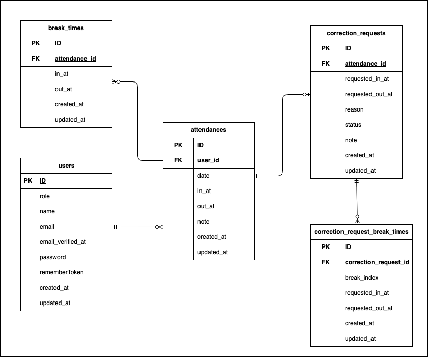

# Attendance

## 機能概要

### 一般ユーザー

- fortifyを使用した認証
- メール認証
- 勤怠打刻
- 月別勤怠一覧確認
- 勤怠詳細確認
- 勤怠修正申請
- 修正申請一覧確認

### 管理者

- fortifyを使用した認証
- 日別勤怠一覧確認
- 勤怠詳細確認 / 修正
- スタッフ一覧確認
- スタッフ別月次勤怠一覧確認
- スタッフ別勤怠 CSV 出力
- 修正申請一覧確認
- 修正申請承認

## 使用技術

- PHP 8.1
- Laravel 8
- Laravel Fortify
- MySQL 8.0.32
- Nginx 1.21.1
- MailHog
- phpMyAdmin

## 環境構築

### 1. リポジトリを取得

```bash
git clone git@github.com:Yu-Sasaki451/Attendance.git
cd Attendance
```

### 2. Docker コンテナを起動

```bash
docker compose up -d --build
```

### 3. Laravel の初期設定

```bash
docker compose exec php bash
```
```bash
composer install
cp .env.example .env
```

`.env` は以下をベースに設定してください。

```env
APP_NAME=Attendance
APP_ENV=local
APP_KEY=
APP_DEBUG=true
APP_URL=http://localhost

DB_CONNECTION=mysql
DB_HOST=mysql
DB_PORT=3306
DB_DATABASE=attendance_db
DB_USERNAME=general_user
DB_PASSWORD=general

MAIL_MAILER=smtp
MAIL_HOST=mailhog
MAIL_PORT=1025
MAIL_USERNAME=null
MAIL_PASSWORD=null
MAIL_ENCRYPTION=null
MAIL_FROM_ADDRESS="noreply@example.com"
MAIL_FROM_NAME="${APP_NAME}"
```

続けて、以下を実行してください。

```bash
php artisan key:generate
php artisan config:clear
php artisan migrate --seed
```

### 4. JavaScript テストの初期設定

JavaScript テストを実行する場合は、`node` コンテナ内で依存パッケージをインストールしてください。

```bash
docker compose exec node npm install
```

## 初期アカウント

`php artisan migrate --seed` 実行後、以下のアカウントでログインできます。

### 管理者

- メールアドレス: `admin@test.com`
- パスワード: `admin123`

### 一般ユーザー

- メールアドレス: `user1@test.com`
- パスワード: `user1234`

ほかにも `user2@test.com` から `user5@test.com` まで同じパスワードで作成されます。

## 動作確認 URL

- 一般ユーザーログイン: [http://localhost/login](http://localhost/login)
- 管理者ログイン: [http://localhost/admin/login](http://localhost/admin/login)
- phpMyAdmin: [http://localhost:8080](http://localhost:8080)
- MailHog: [http://localhost:8025](http://localhost:8025)

## メール認証の確認手順

1. [http://localhost/register](http://localhost/register) からユーザー登録します
2. 登録後、メール認証案内画面へ遷移します
3. 画面内の「認証はこちらから」から MailHog を開きます
4. MailHog で認証メールを確認します
5. メール内の認証リンクを開いて認証完了を確認します

## テスト

Feature テストを実行する場合は、先にテスト用データベースを作成してください。

```bash
docker compose exec mysql mysql -uroot -proot -e "CREATE DATABASE IF NOT EXISTS attendance_test;"
docker compose exec mysql mysql -uroot -proot -e "GRANT ALL PRIVILEGES ON attendance_test.* TO 'general_user'@'%'; FLUSH PRIVILEGES;"
```

その後、PHP コンテナ内で以下を実行してください。

```bash
php artisan test
```

JavaScript テストを実行する場合は、以下を実行してください。

```bash
docker compose exec node npm run test:js
```

## ER 図


